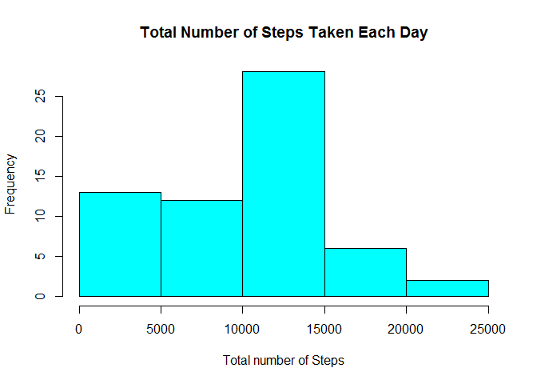
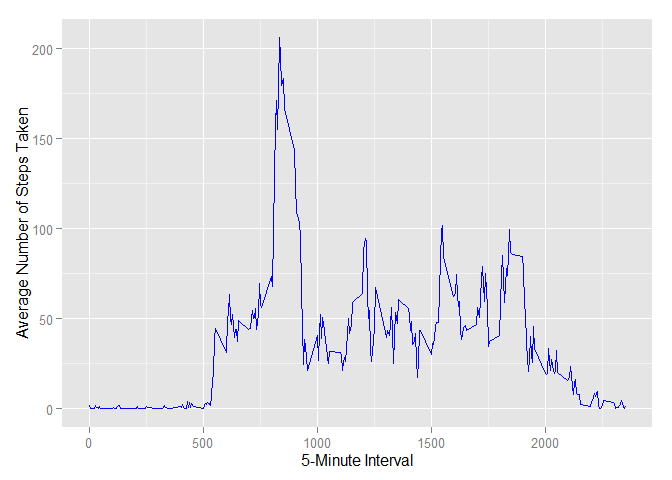
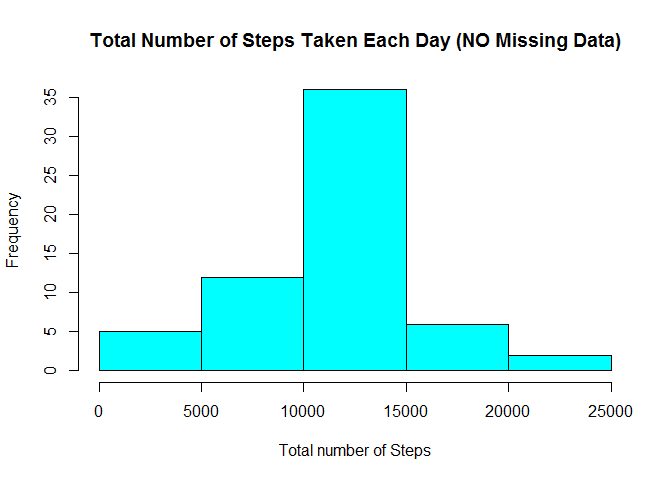

# Reproducible Research - Peer Assessment 1
Srinivas Chakravarty  
10 November 2015  

### Global Options


```r
library ("knitr")
opts_chunk $ set (comment = "->", echo = TRUE)
```

### Housekeeping

```r
pkgsNeeded <- c ("ggplot2", "knitr")
newPkgs <- pkgsNeeded [!(pkgsNeeded  %in%  installed.packages() [, "Package"])]

if (length (newPkgs)) {
    install.packages (newPkgs)
}

lapply (pkgsNeeded, library, character.only = TRUE)
```

```
-> [[1]]
-> [1] "ggplot2"   "knitr"     "stats"     "graphics"  "grDevices" "utils"    
-> [7] "datasets"  "methods"   "base"     
-> 
-> [[2]]
-> [1] "ggplot2"   "knitr"     "stats"     "graphics"  "grDevices" "utils"    
-> [7] "datasets"  "methods"   "base"
```

```r
sourceZipFileName <- "repdata-data-activity.zip"
sourceZipFileUrl <-
    "https://d396qusza40orc.cloudfront.net/repdata%2Fdata%2Factivity.zip"

extractCsvFileName <- "activity.csv"
```

### Loading and preprocessing data

```r
if (! (file.exists (sourceZipFileName))) {
    download.file (sourceZipFileUrl,
                   destfile = sourceZipFileName)
}

unzip (sourceZipFileName)

activityData <- read.csv (extractCsvFileName)
```

### What is mean total number of steps taken per day?

#### 1. Calculate total number of steps taken per day


```r
totalSteps <- tapply (activityData $ steps,
                      activityData $ date,
                      FUN = sum,
                      na.rm = TRUE)
```

#### 2. Make histogram (A) of total number of steps taken each day


```r
hist (totalSteps,
      col = "cyan",
      breaks = 5,
      main = "Total Number of Steps Taken Each Day",
      xlab = "Total number of Steps")
```

 

#### 3. Calculate mean and median of total number of steps taken per day


```r
mean (totalSteps, na.rm = TRUE)
```

```
-> [1] 9354.23
```

```r
median (totalSteps, na.rm = TRUE)
```

```
-> [1] 10395
```

### What is the average daily activity pattern?

#### 1. Make time series plot


```r
averageSteps <- aggregate (x = list (steps = activityData $ steps), 
                          by = list (interval = activityData $ interval),
                          FUN=mean,
                          na.rm=TRUE)

ggplot (data = averageSteps,
        aes (x = interval, y = steps)) +
        geom_line (color = "blue") +
        xlab ("5-Minute Interval") +
        ylab ("Average Number of Steps Taken")
```

 

#### 2. Determine 5-minute interval with maximum number of steps


```r
averageSteps [which.max(averageSteps $ steps),] $ interval
```

```
-> [1] 835
```

### Imputing missing values

#### 1. Calculate total number of missing values in dataset


```r
sum (is.na (activityData))
```

```
-> [1] 2304
```

#### 2. Devise strategy to fill in all missing values in dataset

Fill in missing values in dataset with mean of 5 minute interval

#### 3. Create new dataset from original dataset and with missing data filled in


```r
activityDataNoNA <- activityData

for (i in 1 : nrow (activityDataNoNA)) {
    if (is.na (activityDataNoNA $ steps [i])) {
        activityDataNoNA $ steps [i] <- 
            averageSteps [which (activityData $ interval [i] == 
                                    averageSteps $ interval), ] $ steps
    }
}
```

#### 4A. Make histogram (B) of total number of steps taken each day


```r
totalStepsNoNA <- tapply (activityDataNoNA $ steps,
                          activityDataNoNA $ date,
                          FUN=sum,
                          na.rm = TRUE) 

hist (totalStepsNoNA,
      col = "cyan",
      breaks = 5,
      main = "Total Number of Steps Taken Each Day (NO Missing Data)",
      xlab = "Total number of Steps")
```

 

#### 4B. Calculate mean and median of total number of steps taken per day (NO missing data)


```r
mean (totalStepsNoNA)
```

```
-> [1] 10766.19
```

```r
median (totalStepsNoNA)
```

```
-> [1] 10766.19
```

### Are there differences in activity patterns between weekdays and weekends?

#### 1. Create new factor variable to indicate if a given date is weekday or weekend day


```r
weekdayWeekend <- function (givenDate) {
    if (weekdays (givenDate) %in% 
            c("Monday", "Tuesday", "Wednesday", "Thursday", "Friday"))
        return("weekday")
    else if (weekdays (givenDate) %in% c("Saturday", "Sunday"))
        return("weekend")
}

activityDataNoNA $ day <- sapply (as.Date (activityDataNoNA $ date), FUN=weekdayWeekend)
```

#### 2. Make a panel plot of time series of 5-minute interval average number of steps taken, averaged across weekday days or weekend days


```r
avgStepsNoNA <- aggregate (steps ~ interval + day, data = activityDataNoNA, mean)

ggplot (avgStepsNoNA, aes (interval, steps)) + geom_line (color = "blue") + 
    facet_grid (day ~ .) + xlab ("5-Minute Interval") + ylab ("Average Number of Steps")
```

 
