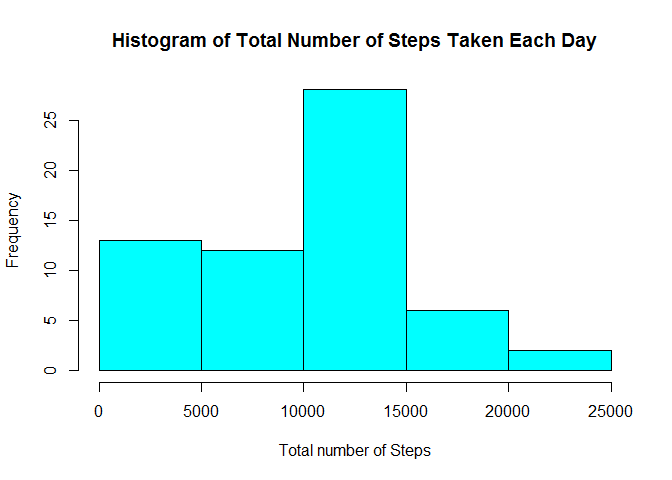
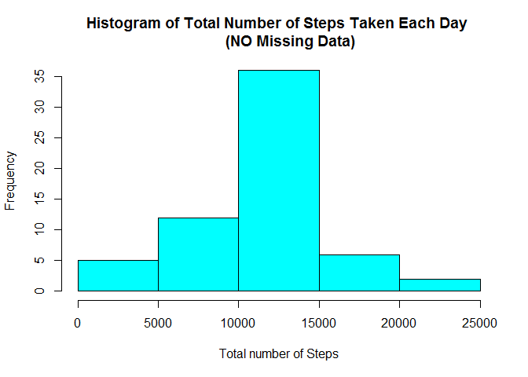
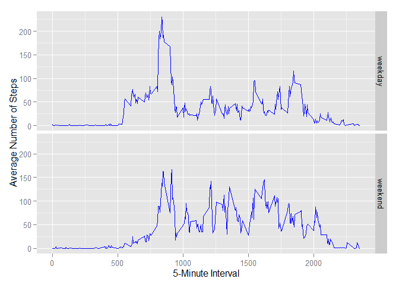

# Reproducible Research: Peer Assessment 1
Srinivas Chakravarty  
17 August 2015  


## Housekeeping

```r
echo = TRUE

source.zipFileName.chr <- "activity.zip"
source.zipFile.url <-
    "https://d396qusza40orc.cloudfront.net/repdata%2Fdata%2Factivity.zip"

extract.csvFileName.chr <- "activity.csv"

pkg.to.load.chr <- c ("ggplot2", "knitr")
lapply (pkg.to.load.chr, library, character.only = TRUE)
```

```
## [[1]]
## [1] "ggplot2"   "stats"     "graphics"  "grDevices" "utils"     "datasets" 
## [7] "methods"   "base"     
## 
## [[2]]
## [1] "knitr"     "ggplot2"   "stats"     "graphics"  "grDevices" "utils"    
## [7] "datasets"  "methods"   "base"
```


## Loading and preprocessing the data

```r
## ---- Download Activity Data zip Dataset as Needed ----
if (! (file.exists (source.zipFileName.chr))) {

    download.file (source.zipFile.url,
                   destfile = source.zipFileName.chr)
}

## ---- Extract Activity Data CSV File ----
unzip (source.zipFileName.chr)

## ---- Create Activity Data Frame from CSV File ----
activityData.df <- read.csv (extract.csvFileName.chr)
```


## What is mean total number of steps taken per day?

```r
## ---- Calculate Total Number of Steps, ignoring Missing Data ----
totalSteps.int <- tapply (activityData.df $ steps,
                          activityData.df $ date,
                          FUN=sum,
                          na.rm = TRUE) 

## ---- Create Histogram of Total Number of Steps Taken per Day ----
hist (totalSteps.int,
      col = "cyan",
      breaks = 5,
      main = "Histogram of Total Number of Steps Taken Each Day",
      xlab = "Total number of Steps")
```

 

```r
# ---- Calculate Mean and Median of Total Number of Steps Taken per Day ----
mean (totalSteps.int, na.rm=TRUE)
```

```
## [1] 9354.23
```

```r
median (totalSteps.int, na.rm = TRUE)
```

```
## [1] 10395
```


## What is the average daily activity pattern?

```r
## ---- Make Time Series Plot ----
averageSteps.df <- aggregate (x = list (steps = activityData.df $ steps), 
                              by = list (interval = activityData.df $ interval),
                              FUN=mean,
                              na.rm=TRUE)

ggplot (data = averageSteps.df,
        aes (x = interval, y = steps)) +
        geom_line (color = "blue") +
        xlab ("5-Minute Interval") +
        ylab ("Average Number of Steps Taken")
```

 

```r
#---- Determine 5-Minute Interval with Maximum Number of Steps ----
averageSteps.df [which.max(averageSteps.df $ steps),] $ interval
```

```
## [1] 835
```


## Inputing missing values

```r
## ---- Determine Number of Missing Values in Activity Dataset ----
sum (is.na (activityData.df))
```

```
## [1] 2304
```

```r
## ---- Create New Activity Dataset with Missing Values as Mean of 5-Minute Interval ----
activityData.noNA.df <- activityData.df

for (i in 1 : nrow (activityData.noNA.df)) {
    if (is.na (activityData.noNA.df $ steps [i])) {
        activityData.noNA.df $ steps [i] <- 
            averageSteps.df [which (activityData.df $ interval [i] == 
                                        averageSteps.df $ interval), ] $ steps
    }
}

## ---- Calculate Total Number of Steps Using Activity Dataset with NO Missing Data ----
totalSteps.noNA.int <- tapply (activityData.noNA.df $ steps,
                          activityData.noNA.df $ date,
                          FUN=sum,
                          na.rm = TRUE) 

## ---- Create Histogram of Total Number of Steps Taken per Day (NO Missing Data) ----
hist (totalSteps.noNA.int,
      col = "cyan",
      breaks = 5,
      main = "Histogram of Total Number of Steps Taken Each Day 
      (NO Missing Data)",
      xlab = "Total number of Steps")
```

 


## Are there differences in activity patterns between weekdays and weekends?

```r
# ---- Calculate Mean and Median of Total Number of Steps Taken per Day (NO Missing Data) ----
mean (totalSteps.noNA.int)
```

```
## [1] 10766.19
```

```r
median (totalSteps.noNA.int)
```

```
## [1] 10766.19
```

```r
## ---- Create New Factor Variable Day as Weekday or Weekend, Based on Date ---- 
weekdayWeekend <- function (givenDate) {
    if (weekdays (givenDate) %in% c("Monday", "Tuesday", "Wednesday", "Thursday", "Friday"))
        return("weekday")
    else if (weekdays (givenDate) %in% c("Saturday", "Sunday"))
        return("weekend")
}

activityData.noNA.df $ day <- sapply (as.Date (activityData.noNA.df $ date),
                                      FUN=weekdayWeekend)
    

## ---- Make Panel Plot of Time Series of 5-Minute Intervals vs. Average Number of Steps ----
averageSteps.noNA.df <- aggregate (steps ~ interval + day,
                                   data = activityData.noNA.df,
                                   mean)
ggplot (averageSteps.noNA.df, aes(interval, steps)) + geom_line(color = "blue") + 
    facet_grid(day ~ .) + xlab ("5-Minute Interval") + ylab ("Average Number of Steps")
```

 
